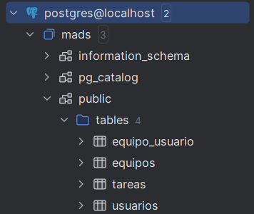
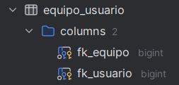
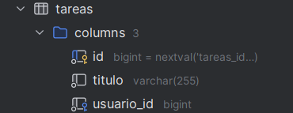
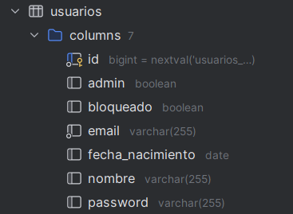

# Documentacion practica 3

La práctica incluye todas las funcionalidades, tanto obligatorias como opcionales.

## 1. Pantalla de la base de datos PostgreSQL

* Tablas  

* Tabla Equipo-Usuario  

* Tabla Equipos  

* Tabla Tareas  

* Tabla Usuarios  

## 2. Endpoints definidos para las acciones

### /equipos

Se muestra una lista con todos los equipos y aparece una opcion para ver los usuarios que componen ese grupo. Como administrador, se pueden modificar y borrar los equipos.

#### Clases y métodos

* EquipoService.java/findAllOrdenadoPorNombre(): Leemos todos los equipos de la base de datos ordenados por nombre y los devolvemos en forma de lista.
* EquipoController.java/equipos(): Llamamos a la funcion findAllOrdenadoPorNombre y devolvemos la plantilla rellenada con los datos de la lista.

#### Plantillas thymeleaf

* listaEquipos.html: En esta plantilla se muestra la lista de equipos y las opciones para editarlos, borrarlos y mostrar los usuarios que los componen. Además, antes de eliminar un equipo, se mostrará un mensaje para que el usuario confirme la opción.

#### Tests

* EquipoServiceTest.java/listadoEquiposOrdenAlfabetico(): Comprueba que los equipos se devuelven ordenados alfabéticamente.
* EquiposWebTest.java/testMostrarEquipos(): Comprueba que se muestran los equipos en la plantila.
* EquiposWebTest.java/testMostrarOpcionEquipo(): Comprueba que se muestra el acceso a la pagina `/equipos` en el navbar.

### /equipos/nuevo

Muestra un formulario para introducir el nombre de un nuevo equipo y lo crea.

#### Clases y métodos

* EquipoService.java/crearEquipo(nombre): Creamos un equipo nuevo en la base de datos con el nombre pasado como argumento.
* EquipoController.java/formNuevoEquipo(): Devolvemos el formulario donde el usuario rellenará los datos que se usarán en el post.
* EquipoController.java/nuevoEquipo(): Llamamos a la función crearEquipo para añadir el nuevo equipo a la base de datos.

#### Plantillas thymeleaf

* formNuevoEquipo.html: En este formulario se rellenarán los datos del nuevo equipo que se introducirá en la base de datos.

#### Tests

* EquipoServiceTest.java/añadirEquipoSinNombreThrowsException(): Comprueba que se lanza una excepción si se intenta añadir un equipo sin nombre.
* EquipoServiceTest.java/añadirEquipoRepetidoThrowsException(): Comprueba que se lanza una excepción si se intenta añadir un equipo con un nombre ya existente.
* EquiposWebTest.java/testMostratFormNuevoEquipo(): Comprueba que se muestra el formulario para añadir un nuevo equipo.
* EquiposWebTest.java/testCrearEquipo(): Comprueba que se crea un nuevo equipo.

### /equipos/{id}/usuarios

Se muestran los usuarios del equipo seleccionado, pudiendo ver los detalles de los mismos. Se podra gestionar la pertenencia al equipo con um boton para añadirse/eliminarse del mismo.

#### Clases y métodos

* EquipoService.java/usuariosEquipo(id): Buscamos en la base de datos el equipo indicado en el id y devolvemos los usuarios que lo componen en forma de lista.
* EquipoController.java/usuariosEquipo(): Llamamos a la función usuariosEquipo para pasarle a la plantilla la lista de usuarios.

#### Plantillas thymeleaf

* listaUsuariosEquipos.html: Se muestra la lista de usuarios con la opcion de ver sus detalles asi como el boton para añadirnos/eliminarnos del equipo.

#### Tests

* EquipoServiceTest.java/recuperarEquiposDeUsuario(): Comprueba que se recuperan los equipos a los que pertenece un usuario.
* EquiposWebTest.java/testGetMiembrosEquipo(): Comprueba que se muestran los miembros de un equipo.

### /equipos/{idEquipo}/addUsuario/{idUsuario}

Se añade un usuario a un equipo.

#### Clases y métodos

* EquipoService.java/añadirUsuarioAEquipo(idEquipo, idUsuario): Añadimos un usuario a un equipo.
* addUsuarioEquipo(): Llamamos a la función añadirUsuarioAEquipo para añadir un usuario a un equipo.

#### Plantillas thymeleaf

* listaUsuariosEquipos.html: Se muestra la lista de usuarios con la opcion de eliminarnos del equipo.

#### Tests

* EquipoServiceTest.java/añaadirUsuarioAEquipo(): Comprueba que se añade un usuario a un equipo.
* EquipoServiceTest.java/añadirUsuarioDuplicado(): Comprueba que no se puede añadir mas de una vez un usuario al mismo equipo.
* EquiposWebTest.java/testAddUsuarioEquipo(): Comprueba que se añade un usuario a un equipo.
* EquiposWebTest.java/testMostrarBotonAñadirUsuarioEquipo(): Comprueba que se muestra el botón para añadir un usuario a un equipo cuando este no pertenece al equipo.

### /equipos/{idEquipo}/deleteUsuario/{idUsuario}

Se elimina un usuario de un equipo.

#### Clases y métodos

* EquipoService.java/eliminarUsuarioDeEquipo(idEquipo, idUsuario): Eliminamos un usuario de un equipo.
* EquipoController.java/deleteUsuarioEquipo(): Llamamos a la función eliminarUsuarioDeEquipo para eliminar un usuario de un equipo.

#### Plantillas thymeleaf

* listaUsuariosEquipos.html: Se muestra la lista de usuarios con la opcion de añadirnos al equipo.

#### Tests

* EquipoServiceTest.java/eliminarUsuarioDeEquipo(): Comprueba que se elimina un usuario de un equipo.
* EquiposWebTest.java/testRemoveUsuarioEquipo(): Comprueba que se elimina un usuario de un equipo.
* EquiposWebTest.java/testMostrarBotonEliminarUsuarioEquipo(): Comprueba que se muestra el botón para eliminar un usuario de un equipo cuando este pertenece al equipo.

### /equipos/{id}/editar

Se edita un equipo. Esta funcionalidad solo está disponible para los administradores.

#### Clases y métodos

* EquipoService.java/editarEquipo(id, nombre): Modificamos un equipo en la base de datos.
* EquipoController.java/formEditarEquipo(): Devolvemos el formulario donde el usuario rellenará los datos que se usarán en el post.
* EquipoController.java/editarEquipo(): Llamamos a la función editarEquipo para modificar un equipo en la base de datos.

#### Plantillas thymeleaf

* formEditarEquipo.html: En este formulario se rellenarán los datos del equipo que se modificará en la base de datos.

#### Tests

* EquipoServiceTest.java/cambiarNombreEquipo(): Comprueba que se edita un equipo.
* EquiposWebTest.java/testMostrarFormEditarEquipo(): Comprueba que se muestra el formulario para editar un equipo.
* EquiposWebTest.java/testNoAdminNoEditaEquipo(): Comprueba que un usuario que no es administrador no puede editar un equipo.
* EquiposWebTest.java/testEditarNombreEquipo(): Comprueba que se edita el nombre de un equipo.

### /equipos/{id}

Se elimina un equipo. Esta funcionalidad solo está disponible para los administradores.

#### Clases y métodos

* EquipoService.java/eliminarEquipo(id): Buscamos el equipo indicado por el id en la base de datos y lo eliminamos.
* EquipoController.java/borrarEquipo(): Hacemos un delete y borramos el equipo de la base de datos llamando a eliminarEquipo() en la capa service.

#### Plantillas thymeleaf

No se añade ninguna plantilla para este endpoint.

#### Tests

* EquipoServiceTest.java/eliminarEquipo(): Comprueba que se elimina un equipo.
* EquiposWebTest.java/testNoAdminNoEliminaEquipo(): Comprueba que un usuario que no es administrador no puede eliminar un equipo.
* EquiposWebTest.java/testEliminarEquipo(): Comprueba que se elimina un equipo.
